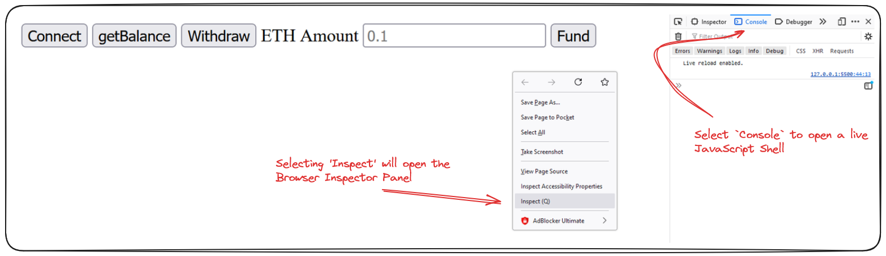
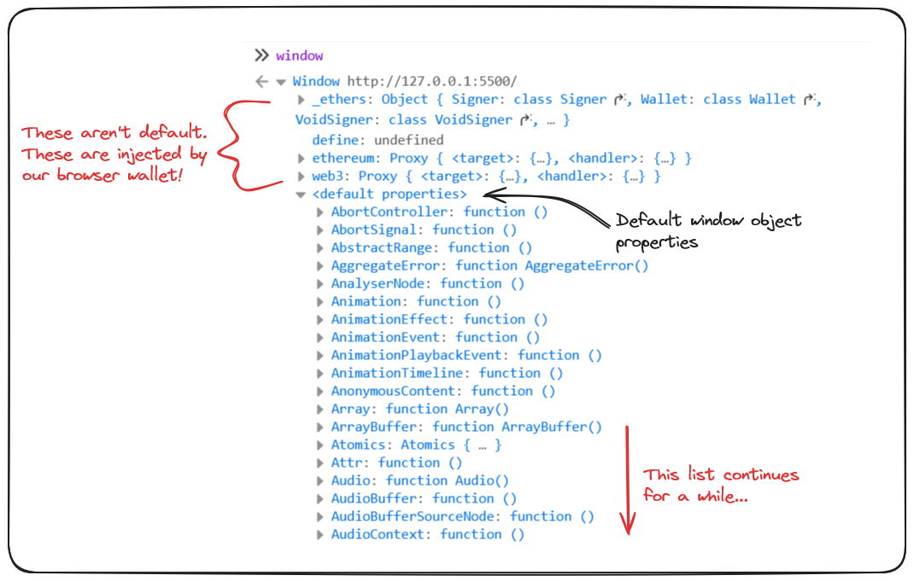
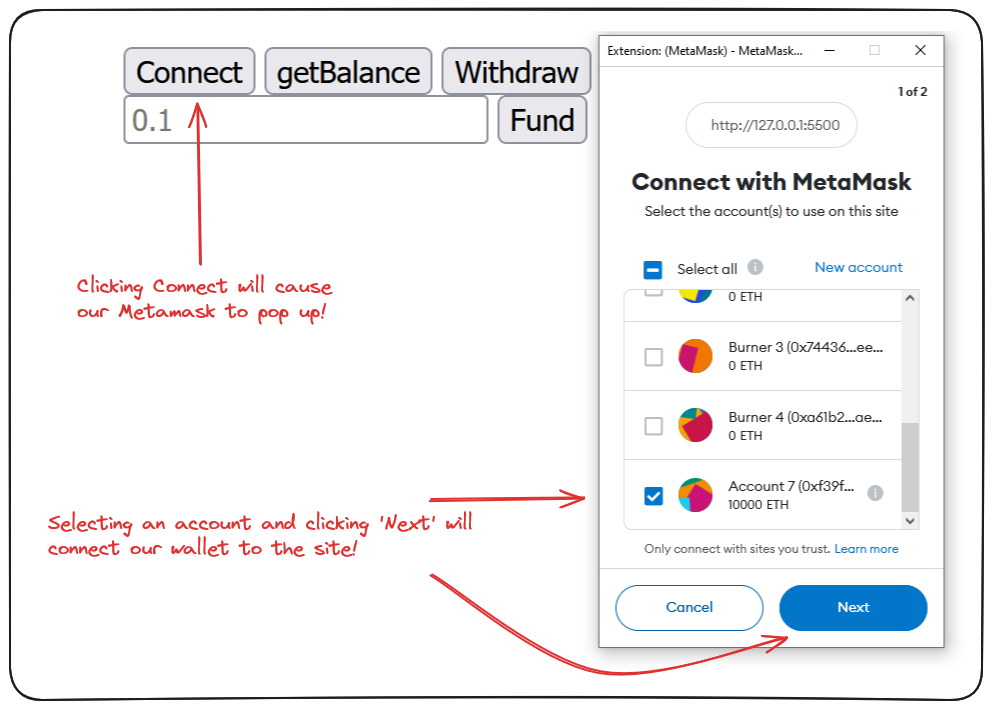
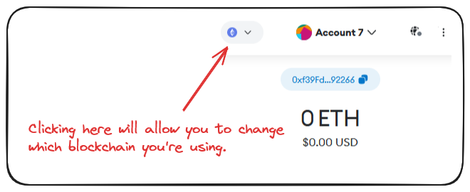
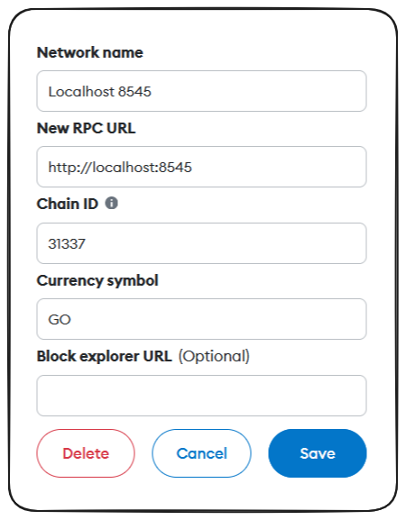
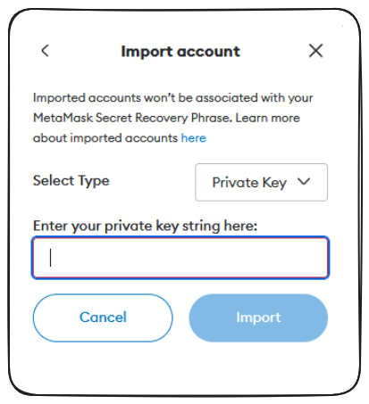
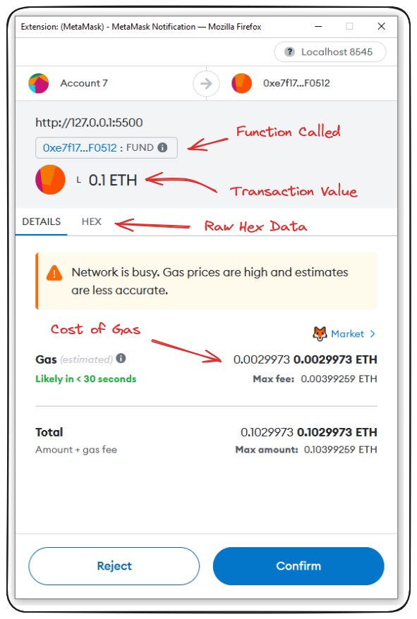
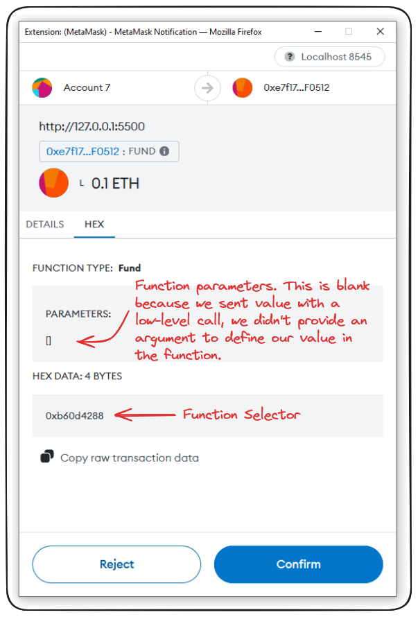
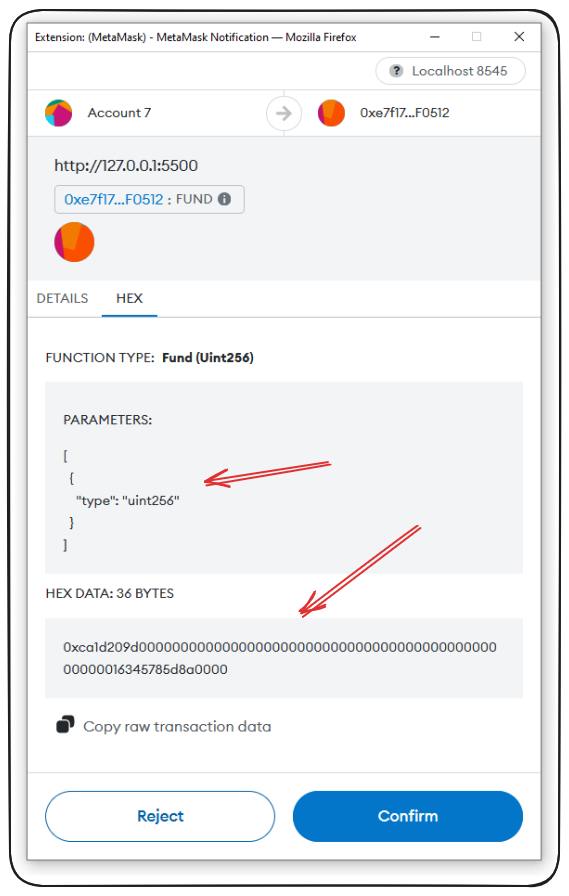

# HTML / Javascript Fund Me (Full Stack / Front End)

In this section, we will delve into how MetaMask or your wallet interacts with websites and ensure that the transactions sent by the wallet are executed as intended. Although we won't be building a full-stack application here, we have plans to launch a comprehensive full-stack course soon. For now, our focus will be on the _HTML FundMe project_, a basic, fully functional website built with raw JavaScript.

## window.ethereum

The first concept we need to grasp when working with a website in Web3 is that of a browser wallet - in our case MetaMask. It's through a wallet like MetaMask that we are able to interact with the blockchain and the Web3 ecosystem.

We can gain more insight into how this works by right-clicking our `FundMe` website and selecting `inspect`. You can also open this panel by pressing F12.



Navigate to the console tab of this panel. This tab contains a live JavaScript shell which houses a tonne of information about the browser we have open. Among this data is a JavaScript object, `window`.

By typing `window` and hitting enter the console will display this object and all of the functions it contains.

We should see something like this:



As seen in the image, there are some properties of this object which are not there by default, one of which is `window.ethereum`. It's through this property that a front end is able to interact with our wallet and it's accounts.

> Try inspecting a browser without a browser wallet installed. You'll see that `window.ethereum` doesn't exist!

I recommend reading the **[MetaMask documentation](https://docs.metamask.io/guide/)** on the window\.ethereum object to learn more.

### The Code

Alright, great. How does the code which interacts with all this look like? We can take a look at the `index.js` file in our html-fund-me repo for this.

One of the first things you'll see is a `connect` function. This is pretty ubiquitous and is how most Web3 websites are told _Hey, I have a browser wallet, here are the accounts I want to use._

```js
async function connect() {
	if (typeof window.ethereum !== 'undefined') {
		try {
			await ethereum.request({ method: 'eth_requestAccounts' });
		} catch (error) {
			console.log(error);
		}
		connectButton.innerHTML = 'Connected';
		const accounts = await ethereum.request({ method: 'eth_accounts' });
		console.log(accounts);
	} else {
		connectButton.innerHTML = 'Please install MetaMask';
	}
}
```

We see the first thing that this function does is checks for our `window.ethereum` object then connects and requests accounts.

> **Note:** This request for accounts does **not** provide access to your private key. It allows the website to send transaction requests to your wallet in order for you to sign.

Let's look briefly at the HTML and how it calls this function.

```html
<body>
	<button id="connectButton">Connect</button>
	...
</body>
```

The body of our `index.html` contains this button (among others) with the `id` `connectButton`.

Switching to our `index.js` we see this:

```js
const connectButton = document.getElementById("connectButton")
...
connectButton.onclick = connect
```

This grabs the element of the webpage by the `id` we set and then uses the `onClick` method to call our `connect` function!

### Connecting in Action

Clicking on the `Connect` button on our `html-fund-me` front end, should trigger our MetaMask to pop up. From there we can select an account and click connect.



You'll know this works if your `Connect` button changes to `Connected` and an address is printed to your browser console.

Now you're ready to interact! The functions on our front-end example should look familiar. They're the same as the FundMe backend we built in the previous section.

Let's try calling `getBalance` and see how it works - if you're chain is currently set to Ethereum, you might actually get a balance.



When the `getBalance` buttons is clicked, this is the function we're calling on our front-end.

```js
async function getBalance() {
	if (typeof window.ethereum !== 'undefined') {
		const provider = new ethers.BrowserProvider(window.ethereum);
		try {
			const balance = await provider.getBalance(contractAddress);
			console.log(ethers.formatEther(balance));
		} catch (error) {
			console.log(error);
		}
	} else {
		balanceButton.innerHTML = 'Please install MetaMask';
	}
}
```

As before, we're checking for the existence of `window.ethereum` and then .. defining a provider.

### RPC URLs and Providers

`ethers` is a javascript package that simplifies the use and interacation of browser wallets with our code.

What `ethers.BrowserProvider(window.ethereum)` is doing, is deriving the providers MetaMask is injecting into our `window.ethereum` object. The providers are the RPC URLs associated with the networks in our MetaMask account.



When we call functions on our front-end. We're effectively making API calls via the RPC URL to the blockchain.

### Trying it Out

In order to get some experience trying this ourselves, we'll need to set up the backend of our project and import our anvil account into MetaMask.

Open your foundry-fund-me directory in VS Code and in your terminal run `anvil`.

This should spin up a local test chain for you. Copy one of the mock private keys it provides you in the terminal, we'll need this to import the account into our MetaMask wallet.

With this chain running, open a second terminal and run the command `make deploy`.

This will compile and deploy our FundMe project onto our locally running blockchain. Assuming you've not run into errors. That's all that's required to set up the back end.

Return to MetaMask, and within your network selector choose `Add Network`.


Select `Add a network manually` linked at the bottom of the served page.

In the subsequent page, inter your local network information as follows and click `Save`.


Next, we need to add one of our `anvil` accounts to the wallet!

Click the account displayed at the top of your MetaMask and select `Add an account or hardware wallet` from the bottom of the list.

You'll be prompted to `add a new account`, `import an account`, or `add a hardware wallet`. Select `import an account` and enter your previously copied mock private key into the field provided.



ALRIGHT. With all the set up done, we should be able to select our `anvil` chain in MetaMask, then select the account we just added and click the `connect` button.

If we click `getBalance` we should have `0` returned in our console reflecting the balance of our deployed contract. At this point, we should be able to enter an amount and click `fund`.

Our MetaMask pops up and has us sign the transaction, funding the contract with the amount we've entered!

```js
async function fund() {
	const ethAmount = document.getElementById('ethAmount').value;
	console.log(`Funding with ${ethAmount}...`);
	if (typeof window.ethereum !== 'undefined') {
		const provider = new ethers.BrowserProvider(window.ethereum);
		const signer = provider.getSigner();
		const contract = new ethers.Contract(contractAddress, abi, signer);
		try {
			const transactionResponse = await contract.fund({
				value: ethers.parseEther(ethAmount),
			});
			await listenForTransactionMine(transactionResponse, provider);
		} catch (error) {
			console.log(error);
		}
	} else {
		fundButton.innerHTML = 'Please install MetaMask';
	}
}
```

The function being called when we click this button is very similar in structure to the other we looked at.

-   look for `window.ethereum`
-   define our `provider`
-   acquire the `signer` (account credentials)
-   define the contract/target of our call
    -   these are hardcoded for simplification purposes in this example and can be found in the **[constants.js](https://github.com/Cyfrin/html-fund-me-cu/blob/main/constants.js)** file of our **[html-fund-me repo](https://github.com/Cyfrin/html-fund-me-cu)**.
-   submit transaction to the target contract with provided arguments.

> **Note:** I'll stress again that this call being made by the front-end does **not** give the front-end access to private key data. The transaction is always sent to the wallet for confirmation/signing.

### Wrap Up

We've learnt a lot about how browser wallets like MetaMask work under the hood and actually send our transactions to the blockchain. Great work - we've more low level concepts to cover in our next lesson.

## Ethereum Transactions

Continuing from the last lesson, when we call the `fund` function our MetaMask is going to pop up with a bunch of information about the transaction.



By clicking the `Hex` tab, we can confirm the raw data for this transaction and exactly which function is being called.



We'll go into `function selectors` a lot more later, but the important thing to understand is that when a Solidity contract is compiled, our functions are converted into a low-level bytecode called a `function selector`.

When we call our `fund` function, this is converted to a `function selector` that we can actually verify using Foundry's `cast` command.

```bash
cast sig "fund()"
```

The above should result in the output `0xb60d4288` and when we compare this to the `Hex` data in our MetaMask, we see that it does indeed match!

Were the function being called something secret/nefarious like `stealMoney()`. This function selector would be completely different. Running our cast command again confirms this clearly with a return of `0xa7ea5e4e`.

We can use this knowledge to verify any function we're calling through our browser wallet by comparing the expected and actual `function selectors` for the transaction.

There's even a way to decode calldata using the cast command.

Let's say our function was a little different and it required an argument.

```js
function fund(uint256 amount) public payable {
    require(amount.getConversionRate(s_priceFeed) >= MINIMUM_USD, "You need to spend more ETH!");
    // require(PriceConverter.getConversionRate(msg.value) >= MINIMUM_USD, "You need to spend more ETH!");
    s_addressToAmountFunded[msg.sender] += amount;
    s_funders.push(msg.sender);
}
```

If we were to call this function, the information MetaMask gives us is a little different.



In this instance, we can use the command `cast --calldata-decode <SIG> <CALLDATA>` to provide us the parameters being passed in this function call!

```bash
cast --calldata-decode "fund(uint256)" 0xca1d209d000000000000000000000000000000000000000000000000016345785d8a0000
```

The above decodes to:

```bash
100000000000000000 [1e17]
```

0.1 Eth! The same amount being passed as an argument to our `fund` call. It seems this function is safe!

### Wrap Up

This more or less summarizes how transactions work through our browser wallet and what we can expect to see from a low-level with respect to the encoded `function selectors` and `calldata`, we'll go over those in more detail later.

I encourage you to experiment with the remaining functions on the front end. A few things to try:

-   Funding and Withdrawing with an account
-   Funding with Account A and Withdrawing with Account B - what happens?
-   Verify the `function selectors` of our other functions

In our next lesson we'll recap everything we've learnt so far 💪

## Connecting HTML to Metamask

[`metamask`](https://docs.metamask.io/wallet/) has many methods that can help you intract with walltets, network, ...

to access a user's account and connect html to your meta mask you can use [`eth_requestAccounts`](https://docs.metamask.io/wallet/how-to/access-accounts/) method.

```js
await ethereum.request({ method: 'eth_requestAccounts' });
```

## Sending a transaction from a Website

This very first thing needed to begin interacting with the blockchain is connecting to it using a [`Provider`](https://docs.ethers.org/v6/single-page/#getting-started__starting-connecting).

-   [`BrowserProvider`](https://docs.ethers.org/v6/single-page/#api_providers__BrowserProvider) => Connect to the MetaMask EIP-1193 object. This is a standard protocol that allows Ethers access to make all read-only requests through MetaMask.

```js
provider = new ethers.BrowserProvider(window.ethereum);
```

-   getSigner => It also provides an opportunity to request access to write operations, which will be performed by the private key that MetaMask manages for the user.

```js
provider = new ethers.BrowserProvider(window.ethereum);
signer = await provider.getSigner();
```

-   you can have the contract instance using `ethers.Contract` class and pass the paramethers.

```js
const contract = new ethers.Contract(contractAddress, abi, signer);
```

you need to connect to a hardhat network in order to fund some amount. so you can add a hardhat network to your metamask.

we can import a hardhat `private key` in our metamask to import the hardhat wallet to our metamask.

## Listening for Events and Completed Transactions

after completing the transaction, we want to give the user some communication. so we can either `listen for tx to be mined`, or `listen for an event`
